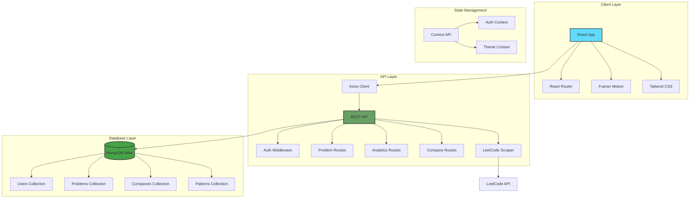
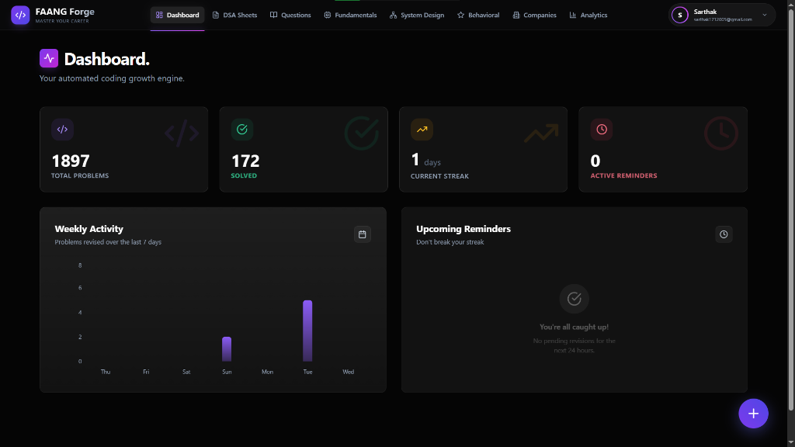
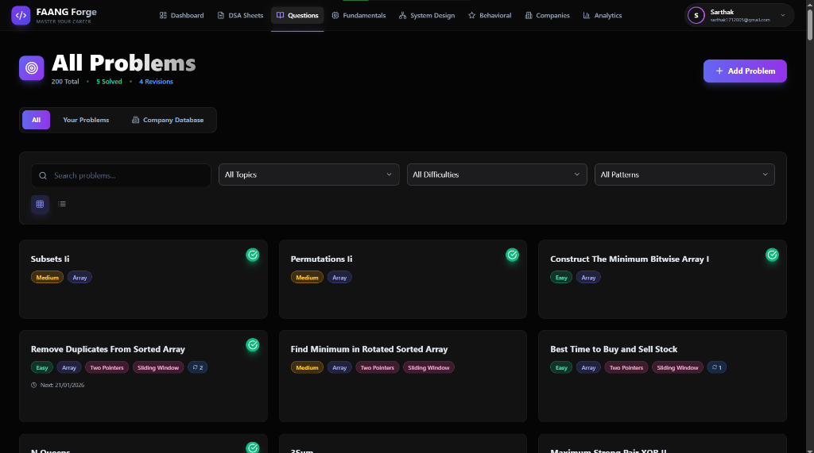
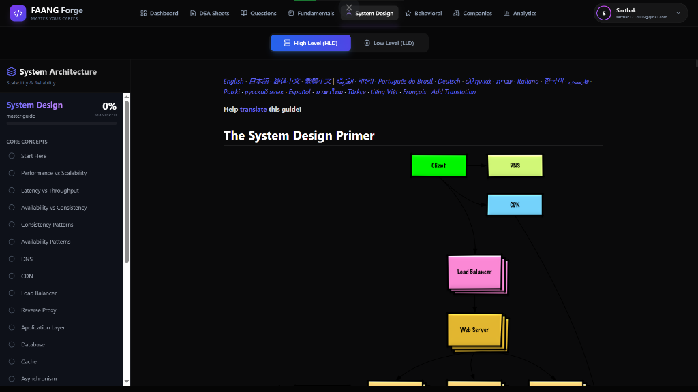

# 🚀 FAANG Forge - Premium Interview Prep Platform

<div align="center">


**A premium, full-stack DSA revision platform with spaced repetition, pattern recognition, and comprehensive Low-Level Design learning**

[Live Demo](https://algo-flow-khaki.vercel.app/) • [Report Bug](https://github.com/iam-sarthakdev/AlgoFlow/issues) • [Request Feature](https://github.com/iam-sarthakdev/AlgoFlow/issues)

</div>

---

## 📌 Table of Contents

- [Overview](#-overview)
- [Features](#-features)
- [Tech Stack](#-tech-stack)
- [Architecture](#-architecture)
- [Project Structure](#-project-structure)
- [Getting Started](#-getting-started)
- [API Documentation](#-api-documentation)
- [Database Schema](#-database-schema)
- [Deployment](#-deployment)
- [Screenshots](#-screenshots)
- [Contributing](#-contributing)
- [License](#-license)

---

## 🎯 Overview

**FAANG Forge** is an intelligent DSA interview preparation platform designed to help developers master coding interviews through:
- **Spaced Repetition**: Scientifically-proven scheduling algorithm for long-term retention
- **Pattern Recognition**: Automatic categorization of 14+ common DSA patterns
- **Company-Specific Practice**: 2892+ problems from 20+ FAANG & top-tier companies
- **Comprehensive LLD**: In-depth Low-Level Design content with real-world case studies
- **Smart Analytics**: Visual insights into your preparation journey

Built with a premium glassmorphic UI and enterprise-grade architecture, FAANG Forge transforms how developers prepare for technical interviews.

---

## ✨ Features

### 🧠 **Intelligent Problem Management**
- **Spaced Repetition Algorithm**: Ebbinghaus forgetting curve-based scheduling
- **Auto-Pattern Recognition**: ML-based categorization into 14+ patterns (Two Pointers, Sliding Window, etc.)
- **LeetCode Integration**: Auto-populate problem statements and examples
- **Revision Tracking**: Monitor solve count, last revised date, and upcoming reminders
- **Company Database**: Browse problems by specific companies (Google, Amazon, Meta, etc.)

### 📊 **Advanced Analytics Dashboard**
- **Revision Streak**: Gamified daily streak tracking
- **Topic Distribution**: Visual breakdown by data structures
- **Difficulty Analysis**: Pie chart of Easy/Medium/Hard problems
- **Progress Timeline**: Historical revision activity
- **Performance Metrics**: Solve rate, average time complexity

### 📚 **Comprehensive System Design**
- **14 LLD Chapters**: From SOLID principles to advanced design patterns
- **GRASP Principles**: All 9 object-oriented design guidelines
- **Real-World Case Studies**: Parking Lot System, Library Management with UML diagrams
- **Interactive Code Examples**: Syntax-highlighted Java implementations
- **Premium Markdown Rendering**: Mac-style code blocks, gradient headers

### 🏢 **Company-Specific Preparation**
- **20+ Companies**: FAANG + Goldman Sachs, Uber, Airbnb, etc.
- **2892+ Problems**: Curated company-tagged questions
- **Tier Badges**: FAANG vs Top Tier classification
- **Problem Import**: Quickly add company problems to your personal list

### 🎨 **Premium UI/UX**
- **Glassmorphic Design**: Modern, translucent cards with backdrop blur
- **Framer Motion Animations**: Smooth, staggered entry animations
- **Responsive Layout**: Mobile-first, works on all devices
- **Dark Mode**: Eye-friendly interface for long study sessions
- **Skeleton Loaders**: Professional loading states

---

## 🛠 Tech Stack

### **Frontend**
| Technology | Purpose |
|------------|---------|
| **React 18** | UI library with hooks & context |
| **React Router v6** | Client-side routing |
| **Framer Motion** | Advanced animations |
| **Tailwind CSS** | Utility-first styling |
| **Recharts** | Data visualization |
| **React Markdown** | Markdown content rendering |
| **Syntax Highlighter** | Code block syntax highlighting |
| **Lucide Icons** | Modern icon library |

### **Backend**
| Technology | Purpose |
|------------|---------|
| **Node.js** | Runtime environment |
| **Express.js** | REST API framework |
| **MongoDB** | NoSQL database |
| **Mongoose** | ODM for MongoDB |
| **JWT** | Authentication |
| **Bcrypt** | Password hashing |
| **Axios** | HTTP client for LeetCode API |

### **Deployment & DevOps**
| Service | Purpose |
|---------|---------|
| **Vercel** | Frontend hosting |
| **Render** | Backend hosting |
| **MongoDB Atlas** | Cloud database |
| **Git & GitHub** | Version control |

---

## 🏗 Architecture



### **Data Flow**

1. **Authentication**: JWT-based auth with httpOnly cookies
2. **Problem Management**: CRUD operations with auto-save
3. **Spaced Repetition**: Server-side calculation of next reminder dates
4. **Analytics**: MongoDB aggregation pipelines for statistics
5. **Pattern Recognition**: Keyword matching algorithm for auto-tagging

---

## 📁 Project Structure

```
FAANG-Forge/
├── client/                      # Frontend React application
│   ├── public/
│   │   └── system-design-data/  # LLD markdown files
│   │       └── lld/
│   │           ├── 01-intro.md
│   │           ├── 02-solid-srp.md
│   │           ├── 13-case-parking-lot.md
│   │           └── ...
│   ├── src/
│   │   ├── components/          # Reusable components
│   │   │   ├── CustomSelect.jsx
│   │   │   ├── Navbar.jsx
│   │   │   └── PageLayout.jsx
│   │   ├── context/             # React Context providers
│   │   │   └── AuthContext.jsx
│   │   ├── pages/               # Route components
│   │   │   ├── DashboardPage.jsx
│   │   │   ├── ProblemsPage.jsx
│   │   │   ├── ProblemDetail.jsx
│   │   │   ├── AnalyticsPage.jsx
│   │   │   ├── SystemDesignPage.jsx
│   │   │   ├── CompaniesPage.jsx
│   │   │   └── LoginPage.jsx
│   │   ├── services/            # API integration
│   │   │   ├── api.js
│   │   │   ├── leetcodeApi.js
│   │   │   └── companyProblemsApi.js
│   │   ├── utils/               # Helper functions
│   │   │   └── constants.js
│   │   ├── styles/
│   │   │   └── theme.js
│   │   ├── App.jsx
│   │   ├── index.css
│   │   └── main.jsx
│   ├── package.json
│   └── vite.config.js
│
├── server/                      # Backend Node.js application
│   ├── src/
│   │   ├── controllers/         # Request handlers
│   │   │   ├── authController.js
│   │   │   ├── problemsController.js
│   │   │   ├── analyticsController.js
│   │   │   ├── companyProblemsController.js
│   │   │   └── leetcodeController.js
│   │   ├── models/              # Mongoose schemas
│   │   │   ├── User.js
│   │   │   ├── Problem.js
│   │   │   └── CompanyProblem.js
│   │   ├── routes/              # API routes
│   │   │   ├── auth.routes.js
│   │   │   ├── problems.routes.js
│   │   │   ├── analytics.routes.js
│   │   │   └── companyProblems.routes.js
│   │   ├── middleware/          # Express middleware
│   │   │   └── auth.js
│   │   ├── config/
│   │   │   └── db.js
│   │   ├── data/                # Seed data
│   │   │   └── companies/
│   │   │       └── [company]-problems.csv
│   │   └── server.js
│   ├── package.json
│   └── .env
│
├── .gitignore
├── README.md
└── LICENSE
```

---

## 🚀 Getting Started

### **Prerequisites**
- Node.js 16+ and npm/yarn
- MongoDB instance (local or Atlas)
- Git

### **Installation**

1. **Clone the repository**
   ```bash
   git clone https://github.com/iam-sarthakdev/AlgoFlow.git
   cd AlgoFlow
   ```

2. **Install dependencies**
   ```bash
   # Install server dependencies
   cd server
   npm install

   # Install client dependencies
   cd ../client
   npm install
   ```

3. **Configure environment variables**

   Create `.env` in the `server` directory:
   ```env
   PORT=5000
   MONGODB_URI=your_mongodb_connection_string
   JWT_SECRET=your_super_secret_jwt_key
   NODE_ENV=development
   ```

   Create `.env` in the `client` directory:
   ```env
   VITE_API_URL=http://localhost:5000
   ```

4. **Seed the database** (Optional)
   ```bash
   cd server
   node src/scripts/seedCompanyProblemsLocal.js
   ```

5. **Run the application**

   ```bash
   # Terminal 1 - Start backend
   cd server
   npm run dev

   # Terminal 2 - Start frontend
   cd client
   npm run dev
   ```

6. **Access the app**
   
   **Live Production Build:**
   - Frontend: [https://algo-flow-khaki.vercel.app/](https://algo-flow-khaki.vercel.app/)
   
   **Local Environment:**
   - Frontend: `http://localhost:5173`
   - Backend: `http://localhost:5000`


---

## 📡 API Documentation

### **Authentication**

| Method | Endpoint | Description |
|--------|----------|-------------|
| POST | `/api/auth/register` | Create new user account |
| POST | `/api/auth/login` | Login user & return JWT |
| POST | `/api/auth/logout` | Logout user |
| GET | `/api/auth/me` | Get current user profile |

### **Problems**

| Method | Endpoint | Description |
|--------|----------|-------------|
| GET | `/api/problems` | Get all user problems (with filters) |
| POST | `/api/problems` | Create new problem |
| GET | `/api/problems/:id` | Get problem by ID |
| PUT | `/api/problems/:id` | Update problem |
| DELETE | `/api/problems/:id` | Delete problem |
| POST | `/api/problems/:id/revise` | Mark problem as revised |

### **Analytics**

| Method | Endpoint | Description |
|--------|----------|-------------|
| GET | `/api/analytics/stats` | Get overall statistics |
| GET | `/api/analytics/trends` | Get revision trends (30 days) |
| GET | `/api/analytics/heatmap` | Get revision heatmap data |

### **Company Problems**

| Method | Endpoint | Description |
|--------|----------|-------------|
| GET | `/api/company-problems` | Get problems by company |
| GET | `/api/companies` | Get all companies with problem counts |

### **Patterns**

| Method | Endpoint | Description |
|--------|----------|-------------|
| GET | `/api/patterns` | Get all available patterns |
| POST | `/api/patterns/auto-tag` | Auto-tag user problems with patterns |

### **LeetCode Integration**

| Method | Endpoint | Description |
|--------|----------|-------------|
| POST | `/api/leetcode/fetch` | Fetch problem details from LeetCode |

---

## 🗄 Database Schema

### **Users Collection**
```javascript
{
  _id: ObjectId,
  name: String,
  email: String (unique),
  password: String (hashed),
  createdAt: Date,
  updatedAt: Date
}
```

### **Problems Collection**
```javascript
{
  _id: ObjectId,
  userId: ObjectId (ref: User),
  title: String,
  problem_name: String,
  topic: String,
  difficulty: Enum ['Easy', 'Medium', 'Hard'],
  url: String,
  notes: String,
  codeSnippet: String,
  timeComplexity: String,
  spaceComplexity: String,
  patterns: [String],
  companies: [String],
  tags: [String],
  hints: [String],
  isSolved: Boolean,
  revision_count: Number,
  last_revised_at: Date,
  next_reminder_date: Date,
  relatedProblems: [ObjectId],
  createdAt: Date,
  updatedAt: Date
}
```

### **CompanyProblems Collection**
```javascript
{
  _id: ObjectId,
  title: String,
  url: String,
  difficulty: String,
  topics: [String],
  companies: [String],
  acceptance: Number,
  createdAt: Date
}
```

---

## 🌐 Deployment

### **Frontend (Vercel)**
1. Push code to GitHub
2. Import repository in Vercel
3. Set environment variables:
   - `VITE_API_URL=https://your-backend-url.onrender.com`
4. Deploy

### **Backend (Render)**
1. Create new Web Service in Render
2. Connect GitHub repository
3. Add MongoDB Atlas connection string
4. Set environment variables
5. Deploy

### **Database (MongoDB Atlas)**
1. Create free cluster
2. Whitelist IP addresses (0.0.0.0/0 for development)
3. Create database user
4. Get connection string
5. Add to backend `.env`

---

### Dashboard


### DSA Sheets


### All Problems


### Fundamentals (OS/DBMS)


### System Design (LLD/HLD)


### Analytics & Performance


### Company Database


### Behavioral Preparation


---

## 🤝 Contributing

Contributions are welcome! Please follow these steps:

1. Fork the repository
2. Create a feature branch (`git checkout -b feature/AmazingFeature`)
3. Commit your changes (`git commit -m 'Add some AmazingFeature'`)
4. Push to the branch (`git push origin feature/AmazingFeature`)
5. Open a Pull Request

### **Development Guidelines**
- Follow existing code style
- Write meaningful commit messages
- Add comments for complex logic
- Test your changes thoroughly
- Update documentation if needed

---

## 📄 License

This project is licensed under the MIT License - see the [LICENSE](LICENSE) file for details.

---

## 👤 Author

**Sarthak Dev**
- GitHub: [@iam-sarthakdev](https://github.com/iam-sarthakdev)
- Email: sarthak1712005@gmail.com
- LinkedIn: [Sarthak Dev](https://linkedin.com/in/sarthakdev)

---

## 🙏 Acknowledgments

- [LeetCode](https://leetcode.com) for problem inspiration
- [Framer Motion](https://www.framer.com/motion/) for animation library
- [Tailwind CSS](https://tailwindcss.com) for styling
- [MongoDB](https://www.mongodb.com) for database
- Open source community for amazing tools

---

<div align="center">

**If you found this project helpful, please consider giving it a ⭐!**

Made with ❤️ by [Sarthak Dev](https://github.com/iam-sarthakdev)

</div>
